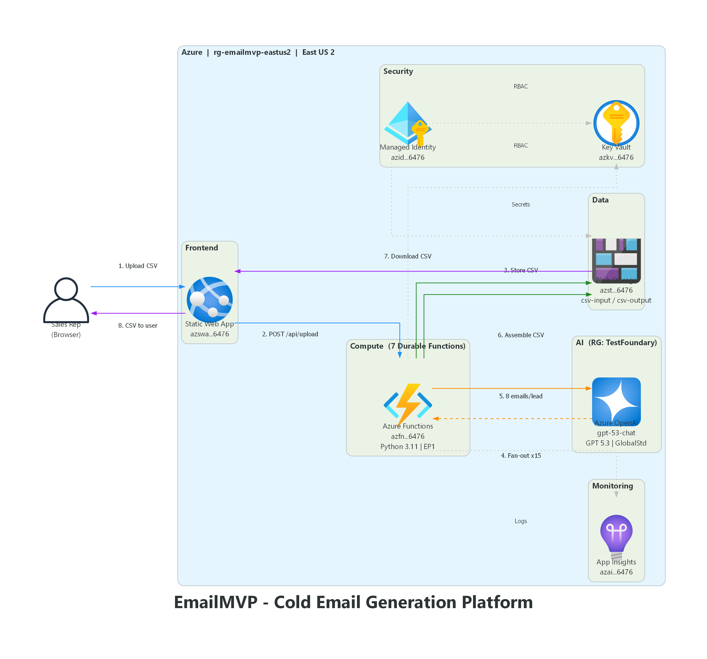

# Reliance Infosystems — Cold Email Generator MVP

Upload a CSV or Excel (.xlsx) file of leads and generate **8 personalized cold email sequences per lead** using **GPT 5.3** on Azure OpenAI. The enriched CSV is returned with 16 new columns (8 Subject + 8 Body) appended after the original data.

**Smart column detection** automatically identifies the required fields (first name, last name, organization, license, engagement objectives) regardless of column order or naming convention — no rigid column layout required.

> **Live URL:** https://blue-mud-0ae74790f.4.azurestaticapps.net

## Architecture



```
[Azure Static Web App]  ──  HTML/CSS/JS (vanilla)
        │
        ▼  /api/*
[Azure Functions App]  ──  Python 3.11, Durable Functions, Premium EP1
   ├── POST /api/upload          → receives CSV/XLSX, detects columns, stores in Blob, starts orchestration
   ├── GET  /api/status/{jobId}  → returns real-time processing progress
   ├── GET  /api/download/{jobId}→ returns enriched CSV
   │
   ├── Orchestrator              → fan-out/fan-in: batches of 100, 2s delay between batches
   ├── Activity: extract_leads   → parses CSV into per-lead dictionaries using column map
   ├── Activity: process_lead    → calls GPT 5.3 per lead, returns 8 email pairs
   └── Activity: assemble_csv    → merges results into output CSV, uploads to Blob
        │
        ▼
[Azure Blob Storage]             ← csv-input / csv-output containers
        │
        ▼
[Azure OpenAI — GPT 5.3]        ← GlobalStandard SKU, deployment: gpt-53-chat
```

## Azure Resources

| Resource | Name | Resource Group |
|---|---|---|
| Function App (Python 3.11, EP1) | `azfn4homfpggr6476` | `rg-emailmvp-eastus2` |
| Static Web App | `azswa4homfpggr6476` | `rg-emailmvp-eastus2` |
| Storage Account | `azst4homfpggr6476` | `rg-emailmvp-eastus2` |
| Key Vault | `azkv4homfpggr6476` | `rg-emailmvp-eastus2` |
| Application Insights | `azai4homfpggr6476` | `rg-emailmvp-eastus2` |
| Managed Identity | `azid4homfpggr6476` | `rg-emailmvp-eastus2` |
| Azure OpenAI (AI Services) | `EnochClaude` | `TestFoundary` |

**Subscription:** `1026bf75-8146-43b4-8f2c-32e69ef52837` (EnochFrance_Sponsorship_Account)
**Region:** East US 2

## Column Detection

The system **automatically detects** the required columns using a hybrid approach:

1. **Fuzzy matching** — Matches column headers against keyword patterns (e.g., "First Name", "firstname", "fname", "Given Name" all map to `first_name`)
2. **LLM fallback** — If fuzzy matching fails for any field, GPT 5.3 is used to resolve the remaining columns
3. **Error rejection** — If a required column can't be found by either method, the file is rejected with a clear error message

### Required Fields

| Field | Example Header Variations |
|---|---|
| First Name | `first_name`, `First Name`, `fname`, `Given Name` |
| Last Name | `last_name`, `Last Name`, `lname`, `Surname`, `Family Name` |
| Organization | `current_company`, `Company`, `Organization`, `Employer`, `Firm` |
| License / Product | `Licenses SKUs`, `License Renewal`, `Subscription`, `Product`, `SKU` |
| Engagement Objectives | `Engagement Objective`, `Goal`, `Purpose`, `Initiative` |

All other columns are automatically included as demographic/psychographic context for email personalization.

**Output:** 16 columns (Subject_Touch1 through Body_Touch8) are **appended at the end** of the original data.

## Project Structure

```
EmailMVP/
├── api/
│   ├── function_app.py          # Main Azure Functions entry (7 functions)
│   ├── prompt_templates.py      # System prompt + user prompt builder
│   ├── csv_processor.py         # CSV/Excel parsing and assembly utilities
│   ├── column_mapper.py         # Smart column detection (fuzzy + LLM fallback)
│   ├── host.json                # Durable Functions config (100 concurrent, 2h timeout)
│   ├── requirements.txt         # Python dependencies (incl. openpyxl)
│   ├── local.settings.json      # Local dev settings
│   └── tests/
│       ├── test_csv_processor.py    # 31 tests
│       ├── test_column_mapper.py    # 23 tests
│       ├── test_prompt_templates.py # 15 tests
│       └── test_function_app.py     # Integration tests
├── frontend/
│   ├── index.html               # Upload UI
│   ├── styles.css               # Styling
│   ├── app.js                   # Frontend logic (upload, poll, download)
│   └── staticwebapp.config.json # SWA routing config
├── infra/
│   └── main.bicep               # Infrastructure as Code
├── architecture_diagram.py      # Generates architecture PNG (Python diagrams library)
├── emailmvp_architecture.png    # Architecture diagram
├── PLAN.md                      # Original design plan & implementation history
└── README.md                    # This file
```

## Tech Stack

| Layer | Technology |
|---|---|
| AI Model | Azure OpenAI GPT 5.3 (`gpt-53-chat`, GlobalStandard) |
| Backend | Azure Functions (Python 3.11, Durable Functions) |
| Frontend | Azure Static Web App (vanilla HTML/CSS/JS) |
| Storage | Azure Blob Storage (identity-based auth) |
| Secrets | Azure Key Vault |
| Auth | Managed Identity with RBAC |
| Monitoring | Application Insights |
| IaC | Bicep |

## Local Development

### 1. Install Python dependencies

```bash
cd api
python -m venv .venv
.venv\Scripts\activate      # Windows
pip install -r requirements.txt
```

### 2. Configure local settings

Edit `api/local.settings.json`:

```json
{
  "IsEncrypted": false,
  "Values": {
    "AzureWebJobsStorage": "UseDevelopmentStorage=true",
    "FUNCTIONS_WORKER_RUNTIME": "python",
    "AZURE_OPENAI_ENDPOINT": "https://enochclaude.openai.azure.com/",
    "AZURE_OPENAI_API_KEY": "<your-api-key>",
    "AZURE_OPENAI_DEPLOYMENT": "gpt-53-chat",
    "AZURE_STORAGE_CONNECTION_STRING": "<your-storage-connection-string>"
  }
}
```

### 3. Start Azurite (local storage emulator)

```bash
azurite --silent --location .azurite --debug .azurite/debug.log
```

Create the required containers:

```bash
az storage container create -n csv-input  --connection-string "UseDevelopmentStorage=true"
az storage container create -n csv-output --connection-string "UseDevelopmentStorage=true"
```

### 4. Run the Functions App

```bash
cd api
func start
```

### 5. Open the frontend

```bash
cd frontend
python -m http.server 4280
```

Then open http://localhost:4280 in your browser.

## Running Tests

```bash
cd api
python -m pytest tests/test_csv_processor.py tests/test_prompt_templates.py -v
```

69 tests total (31 CSV processor + 23 column mapper + 15 prompt templates).

## Deployment

### Deploy Function App (ZIP deploy with remote build)

```powershell
cd EmailMVP
Compress-Archive -Path api\* -DestinationPath deploy.zip -Force
az functionapp deployment source config-zip `
  --resource-group rg-emailmvp-eastus2 `
  --name azfn4homfpggr6476 `
  --src deploy.zip `
  --build-remote true
```

> **Note:** `--build-remote true` is required so Azure installs Python dependencies from `requirements.txt`.

### Deploy Static Web App

The Static Web App is deployed via the Azure portal or Azure CLI. The frontend is vanilla HTML/CSS/JS with no build step.

## Key Design Decisions

- **No RAG** — All context the model needs comes from the CSV row data and the system prompt. No embeddings, vector stores, or document retrieval.
- **Fan-out/fan-in** — Durable Functions process up to 100 leads concurrently per batch, with a 2-second delay between batches to respect rate limits.
- **Excel support** — Accepts both `.csv` and `.xlsx` files. Excel files are converted to CSV at upload time.
- **Smart column detection** — Fuzzy keyword matching with LLM fallback identifies required columns regardless of naming or ordering. No rigid column layout required.
- **Real-time progress** — The orchestrator reports `processedLeads/totalLeads` via `set_custom_status()`, exposed in the status API and displayed in the frontend progress bar. A pulse animation keeps the bar active while the first batch is in-flight.
- **UTF-8 BOM encoding** — CSV output uses `utf-8-sig` so Excel opens it correctly without garbled characters.
- **ASCII-only constraint** — The system prompt enforces plain ASCII to prevent encoding issues (no em dashes, curly quotes, etc.).
- **No license specifics** — The prompt explicitly forbids mentioning specific Microsoft license types (E3, E5, etc.) or seat counts to avoid making recipients feel surveilled.
- **GPT 5.3** — Originally designed for Claude Opus 4.6, but switched to GPT 5.3 due to zero Claude quota in the subscription. Uses `max_completion_tokens` (not `max_tokens`) and default temperature only.

See [PLAN.md](PLAN.md) for the full implementation history and design rationale.

The frontend expects the API at `/api/*`. When using separate servers, update the base URL in `app.js`.

---

## Azure Provisioning

### 1. Resource Group

```bash
az group create --name rg-emailmvp-eastus2 --location eastus2
```

### 2. Azure Foundry — Claude Opus 4.6

1. In the Azure Portal, create a **Microsoft Foundry** resource in **East US2**.
2. Create a project within the Foundry resource.
3. Deploy `claude-opus-4-6` as a **Global Standard** deployment.
4. Copy the **Target URI** and **API Key** from the deployment details.

### 3. Storage Account

```bash
az storage account create \
  --name stemailmvp \
  --resource-group rg-emailmvp-eastus2 \
  --location eastus2 \
  --sku Standard_LRS

az storage container create -n csv-input  --account-name stemailmvp
az storage container create -n csv-output --account-name stemailmvp
```

### 4. Functions App (Premium EP1)

```bash
az functionapp plan create \
  --name plan-emailmvp \
  --resource-group rg-emailmvp-eastus2 \
  --location eastus2 \
  --sku EP1 \
  --is-linux true

az functionapp create \
  --name func-emailmvp \
  --resource-group rg-emailmvp-eastus2 \
  --plan plan-emailmvp \
  --runtime python \
  --runtime-version 3.11 \
  --storage-account stemailmvp \
  --os-type Linux \
  --functions-version 4
```

Configure app settings:

```bash
az functionapp config appsettings set \
  --name func-emailmvp \
  --resource-group rg-emailmvp-eastus2 \
  --settings \
    ANTHROPIC_BASE_URL="https://<resource>.services.ai.azure.com/anthropic" \
    ANTHROPIC_API_KEY="<key>" \
    ANTHROPIC_MODEL="claude-opus-4-6" \
    CSV_INPUT_CONTAINER="csv-input" \
    CSV_OUTPUT_CONTAINER="csv-output"
```

### 5. Static Web App

```bash
az staticwebapp create \
  --name swa-emailmvp \
  --resource-group rg-emailmvp-eastus2 \
  --location eastus2 \
  --sku Standard
```

Link to the Functions App backend via **Bring Your Own Functions** in the Azure Portal (Settings → APIs → Link).

### 6. Key Vault (recommended)

```bash
az keyvault create \
  --name kv-emailmvp \
  --resource-group rg-emailmvp-eastus2 \
  --location eastus2

az keyvault secret set \
  --vault-name kv-emailmvp \
  --name AnthropicApiKey \
  --value "<your-api-key>"
```

Then reference in app settings:

```
ANTHROPIC_API_KEY=@Microsoft.KeyVault(SecretUri=https://kv-emailmvp.vault.azure.net/secrets/AnthropicApiKey)
```

---

## Deployment

### Deploy Functions App

```bash
cd api
func azure functionapp publish func-emailmvp
```

### Deploy Static Web App

Push the repo to GitHub and connect the SWA to the repo, or use the SWA CLI:

```bash
npm i -g @azure/static-web-apps-cli
swa deploy ./frontend --env production
```

---

## Email Touch Sequence

| # | Purpose | Description |
|---|---|---|
| 1 | Introduction | Introduce Reliance as a trusted Microsoft licensing advisor |
| 2 | Diagnostic | Ask a diagnostic question about renewal/licensing pain points |
| 3 | Benefit | Highlight specific benefits of working with a Microsoft partner |
| 4 | Social Proof | Reference anonymized success stories from similar organizations |
| 5 | Authority | Position Reliance as a Microsoft-authorized expert partner |
| 6 | Promo Canvas | Reference current Microsoft promotions/incentives |
| 7 | Switch Plan / Risk Reversal | Address switching risk, offer guarantees |
| 8 | Danger / Close the Loop | Create urgency around renewal deadlines; final CTA |

## Constraints per Email

- Subject: **≤ 7 words**
- Body: **200–260 words**, **≥ 3 paragraphs**
- Closing phrase included (e.g., "Warm regards,")
- **No** signature block, links, or URLs
- Personalized with first name, organization, and license type
